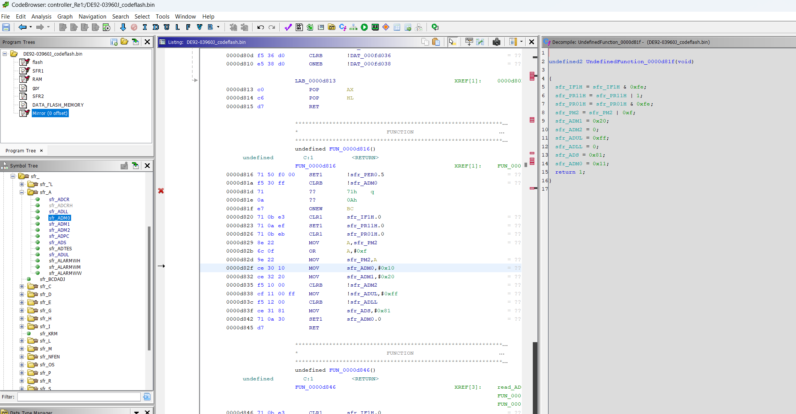

# Renesas RL78 processor module for Ghidra

## Installing the module

Download `rl78.zip` from the latest [release](https://github.com/xyzz/ghidra-rl78/releases) and extract it to `Ghidra/Processors`.

## Building from source

Run the following once to set up the build environment:

```
python3 -mvenv env
. env/bin/activate
pip install -r requirements.txt
```

Ensure Ghidra's `sleigh` utility is in your PATH and then execute:

```
. env/bin/activate
./build.sh
```

The generated `rl78.zip` could then be extracted to `Ghidra/Processors`.

## Register Setup / Loader

You can run the script in `scripts/rl78_loader.py` to setup registers & memory space.
This provides you with annotation such as:



The SFRs are based on the RL78/F15 variant so may need to be adjusted. You will need
to add memory spaces into the `rl78_loader.py` file to exactly match your variant. The
starting address of RAM changes between variants in particular.

### Mirror Area Setup

The RL78 has a "mirror area" of flash which mirrors part of the code memory. You'll often
see loads from this (especially for look-up tables). There is sometimes multiple areas
you can choose to mirror from, but the default seems to be just a simple offset such that
e.g. 0xF3100 reads from 0x3100. The script by default assumes this is the case.

Check it makes sense in the code, if you see tables that seem to be instead an offset of
e.g. 0x1000 or something you might need to adjust this.

### Finding Register Addresses

For small changes it's easy enough to pull from the datasheet. For more automated scripts,
see the Lautcherbach .PER files which seem to cover most of the R5Fxxx series.
